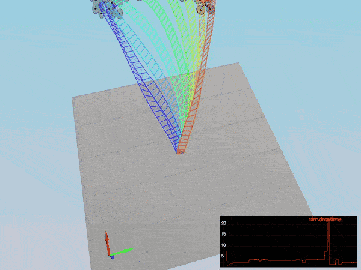
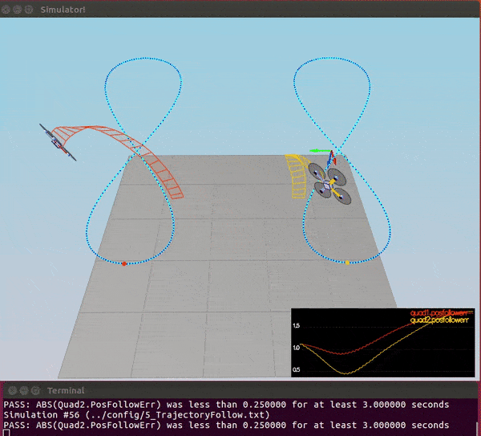

# Project: Quadrotor 3D Controller


## Project description

Implementing a cascade controller for quadrotors in C++ to control body rate/pitch/yaw, altitude, and lateral position.


## Required Steps for a Passing Submission:
1. Setup the [Udacity C++ simulator repository](https://github.com/udacity/FCND-Controls-CPP)
2. Complie and test the simulator
3. Adjust the `Mass` parameter in `QuadControlParams.txt` to make the vehicle stay in the same altitude.
4. Implement body rate control and tune `kpPQR` parameter in `QuadControlParams.txt` to get the vehicle to stop spinning quickly with no overshoot.
5. Implement roll/pitch control and tune `kpBank` in `QuadControlParams.txt` to minimize settling time with minimal overshoot.
6. Implement lateral position control and altitude control and tune `kpPosZ`, `kpPosZ`, `kpVelXY`, `kpVelZ` to get the vehicles to approximately reach to their destination points with some errors.
7. Implement yaw control and tune `kpYaw` and the 3rd component of `kpPQR` to minimize settling time.
8. Tweak the controller parameters to achieve robustness against some of the non-idealities of a controller.
9. Retune the controller parameters to get vehicle to track a trajectory.

## File description

- [QuadControlParams.txt](./cpp/config/QuadControlParams.txt): This file contains the configuration for the controller. The simulator checks config files during run-time and applies new parameters on the next loop execution upon changes.
- [QuadControl.cpp](./cpp/src/QuadControl.cpp): This file contains the implementation of the controller. The original file with placeholders for the controllers was provided by Udacity [here](https://github.com/udacity/FCND-Controls-CPP/blob/master/src/QuadControl.cpp). 

## Scenario description

#### Scenario 1: Intro

This is an introductory scenario to test the simulator and adjust the `Mass` parameters in [QuadControlParams.txt](./cpp/config/QuadControlParams.txt) to make the vehicle stay in the same altitude.


#### Scenario 2: Body rate and roll/pitch control

In this scenario, there is a quadrotor initiated with a small initial rotation speed about its roll axis. The main task is to implement body rate and roll/pitch controllers to stabilize the rotational motion.


#### Scenario 3: Position/velocity and yaw angle control

There are 2 identical quadrotors in this scenario, one offset from its target point initialized with zero yaw and second offset from target point with 45 deg yaw. 
The goal is to stabilize both quads and make them reach their targeted lateral position, while maintaining thier altitude.


#### Scenario 4: Non-idealities and robustness

In this scenario, there are 3 quadrotors with some non-idealities:

- The green quad has its center of mass shifted back
- The orange vehicle is an ideal quad
- The red vehicle is heavier than usual

The main task is to relax the controller to improve the robustness of the control system and get all the quads to reach their destination.


#### Scenario 5: Tracking trajectories

This scenario is designed to test the controller performance in tracking a trajectory. The scenario has two quads:

- The orange one is following [traj/FigureEight.txt](https://github.com/udacity/FCND-Controls-CPP/blob/master/config/traj/FigureEight.txt)
- The other one is following [traj/FigureEightFF.txt](https://github.com/udacity/FCND-Controls-CPP/blob/master/config/traj/FigureEightFF.txt)



## [Rubric Points](https://review.udacity.com/#!/rubrics/1643/view)

## Writeup
### Provide a Writeup / README that includes all the rubric points and how you addressed each one. You can submit your write-up as markdown or pdf.

You're reading it! Below I describe how I addressed each rubric point and where in my code each point is handled.

## Implemented Controller

### Implemented body rate control in C++.

This part is implemented in [QuadControl::BodyRateControl](./cpp/src/QuadControl.cpp#L104-L105):

```cpp
V3F rateErr = pqrCmd - pqr;
momentCmd = V3F(Ixx,Iyy,Izz) * kpPQR * rateErr;
```
### Implement roll pitch control in C++.

This part is implemented in [QuadControl::RollPitchControl](./cpp/src/QuadControl.cpp#L134-L147):

```cpp
float targetBX = 0.0;
float targetBY = 0.0;
if (collThrustCmd > 0.0)
{
  float c = collThrustCmd/mass;
  targetBX = -CONSTRAIN(accelCmd.x/c, -maxTiltAngle, maxTiltAngle);
  targetBY = -CONSTRAIN(accelCmd.y/c, -maxTiltAngle, maxTiltAngle);
}
float bX = targetBX - R(0, 2);
float bY = targetBY - R(1, 2);

pqrCmd.x = kpBank *((R(1, 0) * bX) - (R(0, 0) * bY)) / R(2, 2);
pqrCmd.y = kpBank *((R(1, 1) * bX) - (R(0, 1) * bY)) / R(2, 2);
pqrCmd.z = 0.f;
```

### Implement altitude controller in C++.

This part is implemented in [QuadControl::AltitudeControl](./cpp/src/QuadControl.cpp#L177-L183):

```cpp
float zErr = posZCmd - posZ;
integratedAltitudeError += zErr * dt;

float velZRef = velZCmd + (kpPosZ * zErr) + (KiPosZ * integratedAltitudeError);
velZRef = -CONSTRAIN(-velZRef, -maxDescentRate, maxAscentRate);
float accelCmd = accelZCmd + (kpVelZ*(velZRef - velZ));
thrust = mass * (9.81f - (accelCmd / R(2,2)));
```

### Implement lateral position control in C++.

This part is implemented in [QuadControl::LateralPositionControl](./cpp/src/QuadControl.cpp#L219-L224):

```cpp
velCmd.constrain(-maxSpeedXY,maxSpeedXY);
V3F posErr = posCmd - pos;
V3F velErr = velCmd - vel;
accelCmd = accelCmdFF + (kpPosXY * posErr) + (kpVelXY * velErr); //z compent is zero, so let's ignore use kpPosXY/kpVelXY for pos.z/vel.z as well
accelCmd.constrain(-maxAccelXY,maxAccelXY);
accelCmd.z = 0;
```

### Implement yaw control in C++.

This part is implemented in [QuadControl::YawControl](./cpp/src/QuadControl.cpp#L245-L256):

```cpp
yawCmd = fmod(yawCmd, (2.0f*F_PI));

if (yawCmd <= -F_PI)
{
 yawCmd += (2.0f*F_PI);
}
else if (yawCmd > F_PI)
{
 yawCmd -= (2.0f*F_PI);
}

yawRateCmd = kpYaw * (yawCmd - yaw);
```

### Implement calculating the motor commands given commanded thrust and moments in C++.

This part is implemented in [QuadControl::GenerateMotorCommands](./cpp/src/QuadControl.cpp#L72-L81):

```cpp
float l = L / sqrtf(2.f);
float cBar = collThrustCmd / 4.f;
float pBar = momentCmd.x / (l * 4.f);
float qBar = momentCmd.y / (l * 4.f);
float rBar = momentCmd.z / (kappa * 4.f);

cmd.desiredThrustsN[0] = cBar + pBar + qBar + rBar; // front left
cmd.desiredThrustsN[1] = cBar - pBar + qBar - rBar; // front right
cmd.desiredThrustsN[2] = cBar + pBar - qBar - rBar; // rear left
cmd.desiredThrustsN[3] = cBar - pBar - qBar + rBar; // rear right
```

## Flight Evaluation

### Your C++ controller is successfully able to fly the provided test trajectory and visually passes inspection of the scenarios leading up to the test trajectory.

The results are displayed above and can be found in  folder. The implementation passes scenarios 1 to 5:

```
# Scenario 1
PASS: ABS(Quad.PosFollowErr) was less than 0.500000 for at least 0.800000 seconds
# Scenario 2
PASS: ABS(Quad.Roll) was less than 0.025000 for at least 0.750000 seconds
PASS: ABS(Quad.Omega.X) was less than 2.500000 for at least 0.750000 seconds
# Scenario 3
PASS: ABS(Quad1.Pos.X) was less than 0.100000 for at least 1.250000 seconds
PASS: ABS(Quad2.Pos.X) was less than 0.100000 for at least 1.250000 seconds
PASS: ABS(Quad2.Yaw) was less than 0.100000 for at least 1.000000 seconds
# Scenario 4
PASS: ABS(Quad1.PosFollowErr) was less than 0.100000 for at least 1.500000 seconds
PASS: ABS(Quad2.PosFollowErr) was less than 0.100000 for at least 1.500000 seconds
PASS: ABS(Quad3.PosFollowErr) was less than 0.100000 for at least 1.500000 seconds
# Scenario 5
PASS: ABS(Quad2.PosFollowErr) was less than 0.250000 for at least 3.000000 seconds
```
