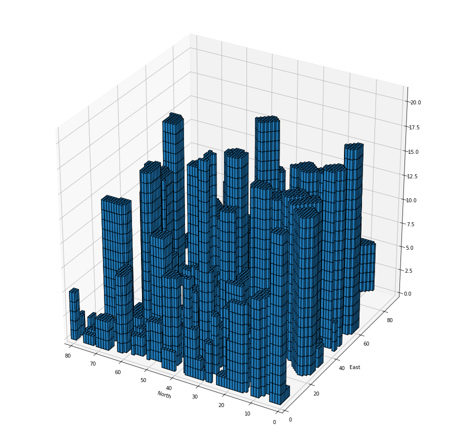
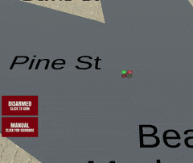
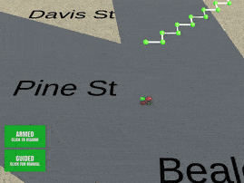

## Project: 3D Motion Planning



# Required Steps for a Passing Submission:
1. Load the 2.5D map in the colliders.csv file describing the environment.
2. Discretize the environment into a grid or graph representation.
3. Define the start and goal locations.
4. Perform a search using A* or other search algorithm.
5. Use a collinearity test or ray tracing method (like Bresenham) to remove unnecessary waypoints.
6. Return waypoints in local ECEF coordinates (format for `self.all_waypoints` is [N, E, altitude, heading], where the drone’s start location corresponds to [0, 0, 0, 0].
7. Write it up.
8. Congratulations!  Your Done!

## [Rubric](https://review.udacity.com/#!/rubrics/1534/view) Points
### Here I will consider the rubric points individually and describe how I addressed each point in my implementation.

### README

#### 1. Provide a Writeup / README that includes all the rubric points and how you addressed each one. You can submit your writeup as markdown or pdf.

You're reading it! Below I describe how I addressed each rubric point and where in my code each point is handled.

### Explain the Starter Code

#### 1. Explain the functionality of what's provided in `motion_planning.py` and `planning_utils.py`
These scripts contain a basic planning implementation that includes:
1. `planning_utils.py`:
    1. `create_grid(data, drone_altitude, safety_distance)`:
        Returns a 2D grid representation of the configuration space given obstacles defined in *data*, and based on *drone_altitude* and *safety_distance* arguments. The obstacles are padded in all directions (up, north, south, west, east) by *safety_distance*.
    2. `Action`:
        Defines possible navigation actions. Actions are desifined as tupples where the first 2 values are the delta of the action relative to the current position, and the third value is the cost of performing the action.
        
        `Action` class methods:
        
            cost: returns the cost of performing the action.
            delta: returns the delata of the action relative to the current position.
        
    3. `valid_actions(grid, current_node)`:
        Returns a list of valid actions given a *grid* and *current_node* arguments by checking obstacles on the *grid*.
    4. `a_star(grid, h, start, goal)`:
        Returns a path between the *start* and *goal* by implementing A\* algorithm over given *gird* and using heuristic function, *h*. 
    5. `heuristic(position, goal_position)`:
        Returns the heuristic cost for the path from *position* to *goal_position* arguments.
        
2. `motion_planning.py`:
    - `motion_planning.py` is an extension to `backyard_flyer_solution.py`, in which a new `plan_path` method and `PLANNING` state are added to incorporate path planning methods (here A\*) to find a path from start to goal positions.
    Path planning occurs aftre arming and before take off. Once armed, `plan_path` method is called to generate a path (a lits of waypoints) and the flying state transients to `PLANNING` state, at which the drone takes off and follows waypoints. Here is a comparison between the `backyard_flyer` state machine (up) and that of `motion_planning` (bottom):
  

**Test Result:** Here is the results of running `backyard_flyer_solution.py` (left) and `motion_planning.py` (right) scripts:

  

### Implementing Your Path Planning Algorithm

#### 1. Set your global home position
The `lat0` and `lon0` values are extracted from colliders csv file into a dictionary with `lat0` and `lon0` values:
```python
# Read lat0, lon0 from colliders into a dictionary with lat0, lon0 values
def converter(s):
    l=str(s, 'utf-8').split(' ')
    d={l[0]:float(l[1])}
    return d

data = np.genfromtxt(self.map_file, max_rows=1, delimiter=',', converters={0:converter,1:converter}, dtype=object, autostrip=True)
global_home_position = dict()
for d in data:
    global_home_position.update(d)
```
Then home position is set based on the `lat0` and `lon0` values:
```python
# Set home position to (lon0, lat0, 0)
self.set_home_position(global_home_position['lon0'],
                      global_home_position['lat0'],
                      0.0)
```

#### 2. Set your current local position
This is done using `global_to_local` method, which converts a global position to a local position relative to the home position:
```python
local_position = global_to_local(self.global_position, self.global_home)
```

#### 3. Set grid start position from local position
This is done by appling the north and east offsets to the local position to get the start location on the grid:
```python
# Convert start position to current position rather than map center
grid_start=(int(local_position[0])-north_offset,int(local_position[1]) -east_offset)
```

#### 4. Set grid goal position from geodetic coords
This is done by using `global_to_local` method to convert any `(lat, lon)` within the map to a position relative to the global home position, subsequently the goal position on the grid is set by applying the offsets.
```python
# adapt to set goal as latitude / longitude position and convert
goal_position = global_to_local(goal_coordinate, self.global_home)
print('global goal position {}'.format(goal_position))

grid_goal = (int(goal_position[0])-north_offset, int(goal_position[1])-east_offset)
```

This part is tested by selecting a random position around local position, but any set of `(lat, lon)` works as well:
```python
# select a random goal coordinate
converage_radius = 50
random_goal_coordinate = local_to_global([local_position[0]+random.uniform(-converage_radius, converage_radius),
                local_position[1]+random.uniform(-converage_radius, converage_radius),
                0.0], self.global_home)

# goal_coordinate = [lat,lon,up]
goal_coordinate = random_goal_coordinate
```

#### 5. Modify A* to include diagonal motion (or replace A* altogether)
Minimal requirement here is to modify the code in planning_utils() to update the A* implementation to include diagonal motions on the grid that have a cost of sqrt(2), but more creative solutions are welcome. Explain the code you used to accomplish this step.

#### 6. Cull waypoints 
For this step you can use a collinearity test or ray tracing method like Bresenham. The idea is simply to prune your path of unnecessary waypoints. Explain the code you used to accomplish this step.

### Execute the flight
#### 1. Does it work?
It works!

### Double check that you've met specifications for each of the [rubric](https://review.udacity.com/#!/rubrics/1534/view) points.

# Extra Challenges: Real World Planning

For an extra challenge, consider implementing some of the techniques described in the "Real World Planning" lesson. You could try implementing a vehicle model to take dynamic constraints into account, or implement a replanning method to invoke if you get off course or encounter unexpected obstacles.

